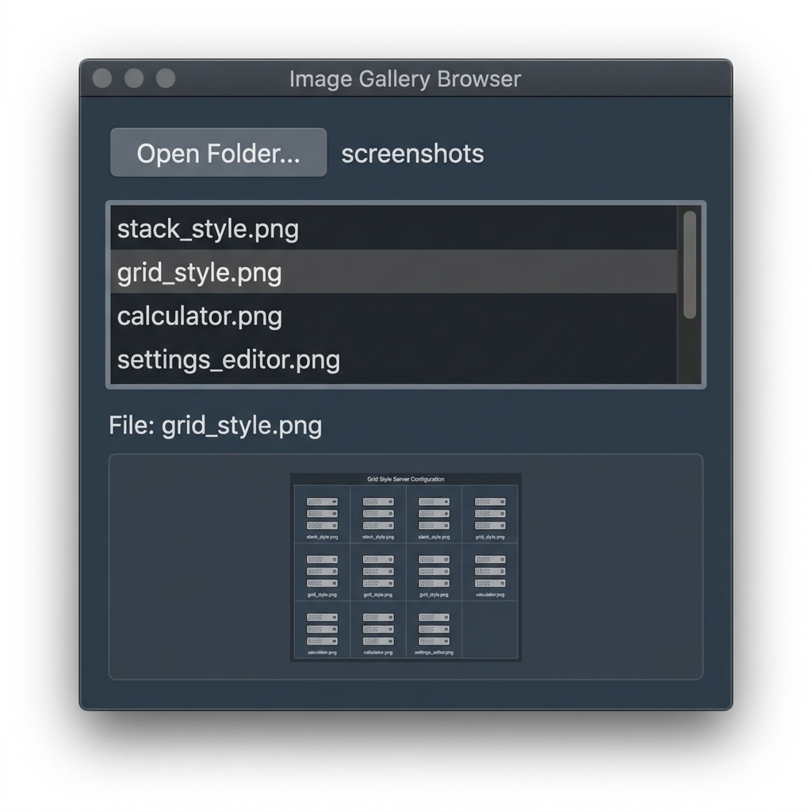

# V macOS Native Window

A small macOS-native GUI starter project written in V, designed to feel approachable for programmers coming from Python, Delphi, or VBA.

## What this project does

This project combines:

- a lightweight V-side wrapper for creating GUI controls
- a native Cocoa bridge for real macOS windows and controls
- a beginner-friendly API for adding named controls, setting/getting values, and attaching event handlers

It is intended to make GUI programming feel more direct and less manual than the raw Cocoa/Objective-C approach.

## Features

- Create named controls such as labels, text inputs, text areas, buttons, checkboxes, and number fields
- Set and read values by control name
- Support multiple controls of the same kind using distinct names
- Attach simple event handlers for clicks and value changes
- Open a real native macOS window with a built-in demo
- Support native keyboard shortcuts: **CMD + F** to toggle full screen, **CMD + Q** to quit the application
- Pin a window above other windows with the new always-on-top API

## Example

```v
import simplegui

fn main() {
    mut gui := simplegui.new_simple_window('My App', 700, 500)

    gui.add_input('name', 'Ada')
    gui.add_button('run', 'Run')

    gui.on_change('name', on_name_changed)
    gui.on_click('run', on_run_clicked)

    gui.run()
}

fn on_name_changed(mut win &simplegui.SimpleWindow, value string) {
    println('name changed: ${value}')
}

fn on_run_clicked(mut win &simplegui.SimpleWindow) {
    println('run clicked')
}
```

## Quick start template

```v
module main

import simplegui

fn main() {
    mut win := simplegui.new_simple_window('Starter', 640, 420)
    win.add_input('name', 'Ada')
    win.add_button('save', 'Save')
    win.on_click('save', fn (mut win &simplegui.SimpleWindow) {
        println("saved: ${win.get_text('name')}")
    })
    win.run()
}
```

## Faster form building

For common forms, a few high-level helpers keep the code short:

```v
mut win := simplegui.new_simple_window('Profile', 640, 420)
win.configure(fn (mut cfg simplegui.WindowConfig) {
    cfg.title = 'Profile'
    cfg.padding = 18
    cfg.spacing = 10
})
win.form('Account', fn (mut w &simplegui.SimpleWindow) {
    w.add_input('email', 'ada@example.com')
    w.add_checkbox('newsletter', 'Subscribe', true)
})
win.section('Preferences', fn (mut w &simplegui.SimpleWindow) {
    w.add_number('experience', 8)
})
win.add_action('save', 'Save', fn (mut win &simplegui.SimpleWindow) {
    println(win.validate_controls({
        'email': simplegui.validate_not_empty
    }))
})
```

## Developer tips

- Use the built-in control discovery helpers: `has_control`, `list_controls`, and `get_control_kind`.
- Calling `get_value`, `set_value`, `get_checked`, or similar on a missing control now raises a clear panic to make mistakes visible early.
- The API is intentionally lightweight; start with the named control helpers and add layout helpers only when needed.

## Screenshots

### 1. Vertical Stack Style (Default Layout)


### 2. Grid & Row Layout (Columns aligned side-by-side)


### 3. Interactive Keypad Calculator


### 4. Advanced Preferences Settings Editor


### 5. Database Query Viewer & Filter


### 6. Scheduled Timer Loader Task


### 7. Interactive List & Image Selector Dashboard



### 8. Interactive Events & State Controller


### 9. Single-Window Control Showcase


## Requirements

- macOS
- V installed and available on your PATH
- Xcode Command Line Tools

## Run the demos

This project supports two different layout styles:

1. **Vertical Stack Style**: The default linear, top-to-bottom layout.
2. **Grid / Row-based Style**: Allows grouping multiple controls side-by-side inside rows.

### Run the main demo (which combines both styles):

```bash
v run .
```

### Run the Stack Style demo:

```bash
v run demos/stack_style.v
```

### Run the Grid Style demo:

```bash
v run demos/grid_style.v
```

### Run the starter template:

```bash
v run demos/starter_template.v
```

### Run the Calculator demo:

```bash
v run demos/calculator.v
```

### Run the Settings Editor demo:

```bash
v run demos/settings_editor.v
```

### Run the Data Viewer/Filter demo:

```bash
v run demos/data_viewer.v
```

### Run the Timer & Progress loader demo:

```bash
v run demos/timer_demo.v
```

### Run the List & Image Preview Selector demo:

```bash
v run demos/list_image_demo.v
```

### Run the Interactive Events & States demo:

```bash
v run demos/events_demo.v
```

### Run the single-window all-controls demo:

```bash
v run demos/all_controls_demo.v
```

### Run the always-on-top demo:

```bash
v run demos/always_on_top_demo.v
```

### Run the Ergonomic Helpers demo:

```bash
v run demos/ergonomic_demo.v
```

### Run the Delphi & C# Inspired RAD Showcase demo:

```bash
v run demos/delphi_inspired_demo.v
```

### Run the developer experience (DX) showcase demo:

```bash
v run demos/dx_features_demo.v
```

### Run the High-Level Helpers demo:

```bash
v run demos/high_level_demo.v
```

### Run the Native Menu Bar & Text Shortcuts demo:

```bash
v run demos/menu_demo.v
```

## Run tests

```bash
v test .
```

## Project files

- [main.v](main.v) — example app and demo entry point
- [demos/starter_template.v](demos/starter_template.v) — minimal starter app for new developers
- [simplegui/simplegui.v](simplegui/simplegui.v) — beginner-friendly wrapper API module
- [simplegui/window.m](simplegui/window.m) — native macOS bridge implementation
- [simplegui/window.h](simplegui/window.h) — bridge declarations used by V
- [simplegui_test.v](simplegui_test.v) — regression tests for the wrapper API
- [demos/stack_style.v](demos/stack_style.v) — demo of clean, vertical form stacking
- [demos/grid_style.v](demos/grid_style.v) — demo of side-by-side row-based grids
- [demos/calculator.v](demos/calculator.v) — interactive math calculator showing nested grid rows
- [demos/settings_editor.v](demos/settings_editor.v) — advanced dashboard containing date picker, color wells, modes
- [demos/data_viewer.v](demos/data_viewer.v) — mock database user records lookup table with filters
- [demos/timer_demo.v](demos/timer_demo.v) — background timer tasks updating progress indicators periodically
- [demos/list_image_demo.v](demos/list_image_demo.v) — interactive list selector previewing mockup screenshots in real time
- [demos/events_demo.v](demos/events_demo.v) — advanced event listener triggers for hover, focus, lose focus (blur), and window resizes
- [demos/all_controls_demo.v](demos/all_controls_demo.v) — single-window demo that exercises many controls in one place
- [demos/high_level_demo.v](demos/high_level_demo.v) — showcases the new beginner-friendly helper API for forms and actions
- [demos/menu_demo.v](demos/menu_demo.v) — demo of standard macOS application menus and text editing shortcuts
- [demos/dx_features_demo.v](demos/dx_features_demo.v) — showcases the developer experience (DX) ergonomics improvements (reflection form building, chaining, nameless controls, action rows, and debug mode)

## Notes

The goal of this project is to provide a simple, high-abstraction GUI layer that feels familiar to people who are used to event-driven environments like Delphi, VBA, or Python-based UI toolkits.
